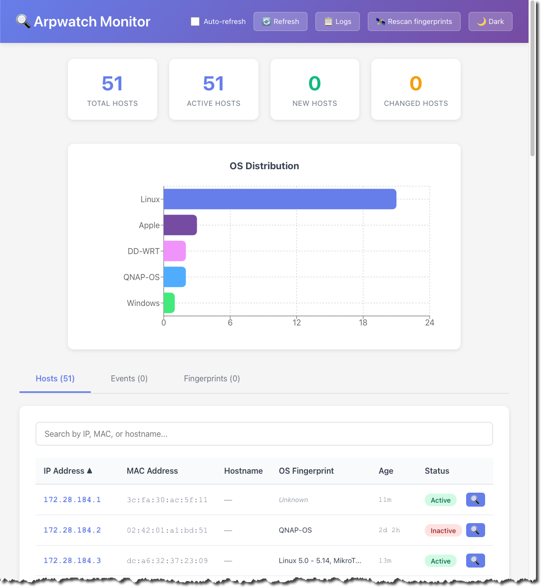

# Arpwatch Web UI

[](LICENSE)
[](VERSION)
[](https://www.docker.com/)
[](https://www.python.org/)
[](https://react.dev/)

**Author:** Walter Hofstetter  
**License:** GPLv2 (see `LICENSE`)

A modern, containerized web interface for monitoring Arpwatch network activity. This project provides a real-time dashboard to view ARP (Address Resolution Protocol) entries, monitor network changes, and track ARP events with automatic reverse DNS lookup.

## 📸 Screenshots



## 🚀 Features

- **Real-time Monitoring**: Auto-refreshing dashboard showing current ARP table
- **Event Logging**: Track new stations, changed ethernet addresses, and flip-flop events
- **Search & Filter**: Quickly find hosts by IP address, MAC address, or hostname
- **Statistics Dashboard**: Overview of total hosts, active hosts, and network changes
- **Modern UI**: Clean, responsive design built with React
- **Containerized**: Fully containerized with Docker Compose for easy deployment

## 📋 Prerequisites

- Docker and Docker Compose installed
- Network interface access (for Arpwatch to monitor)
- Linux host (Arpwatch requires network monitoring capabilities)

## 🛠️ Installation

### Step 1: Install Arpwatch on the Host

Arpwatch needs direct network interface access, so it runs natively on the host:

```bash
cd arpwatch-ui
sudo ./install-arpwatch.sh ens18
```

Replace `ens18` with your network interface name. See [HOST_SETUP.md](HOST_SETUP.md) for detailed instructions.

### Step 2: Start the Web UI Containers

```bash
docker compose up -d --build
```

### Step 3: Access the Web UI

- Open your browser and navigate to: `http://localhost:3000` (or port 8080 if configured)
- API documentation available at: `http://localhost:8000/docs`

## 🏗️ Architecture

The project consists of two main components (Arpwatch runs natively on the host):

### 1. Arpwatch (Host Service)
- Runs natively on the host system (not containerized)
- Monitors network interface for ARP activity
- Logs events and maintains ARP database in `/var/lib/arpwatch/arp.dat`
- Managed via systemd service

### 2. Backend API (FastAPI)
- RESTful API to access Arpwatch data
- Parses `arp.dat` database file
- Reads and processes log files
- Exposes endpoints for hosts, events, and statistics

### 3. Frontend (React + Nginx)
- Modern web interface built with React
- Real-time updates with auto-refresh
- Responsive design for desktop and mobile
- Served via Nginx

## 📡 API Endpoints

- `GET /api/hosts` - Get all ARP entries with reverse DNS hostnames
- `GET /api/hosts/{ip_address}` - Get specific host by IP
- `GET /api/events?limit=100` - Get recent ARP events
- `GET /api/stats` - Get statistics summary
- `GET /api/search?q=query` - Search hosts by IP, MAC, or hostname
- `GET /api/debug` - Debug endpoint to check arpwatch data files

## ⚙️ Configuration

### Environment Variables

**Backend Container:**
- `ARPWATCH_DATA_DIR`: Path to Arpwatch data directory (default: `/var/lib/arpwatch`)
- `ARPWATCH_LOG_DIR`: Path to Arpwatch log directory (default: `/var/log/arpwatch`)
- `ENABLE_OS_FINGERPRINTING`: Enable/disable OS fingerprinting feature (default: `true`)
- `ENABLE_PORT_SCANNING`: Enable/disable port scanning feature (default: `true`)
- `SCAN_PORTS`: Comma-separated list of ports to scan (default: `21,22,80,443,445`)
- `EXCLUDE_IP_RANGES`: Comma-separated CIDR ranges to exclude from monitoring/scanning (e.g., `192.168.2.0/24` for VPN ranges) (default: empty)

**Frontend Container:**
- `REACT_APP_API_URL`: Backend API URL (default: `http://localhost:8000`)

### Customizing Network Interface

To change the network interface monitored by Arpwatch, edit the systemd service:

```bash
sudo nano /etc/systemd/system/arpwatch.service
```

Change the interface in the `ExecStart` line, then:

```bash
sudo systemctl daemon-reload
sudo systemctl restart arpwatch
```

## 🔍 Usage

1. **Start the services:**
   ```bash
   docker-compose up -d
   ```

2. **View logs:**
   ```bash
   docker-compose logs -f
   ```

3. **Stop the services:**
   ```bash
   docker-compose down
   ```

4. **Rebuild after changes:**
   ```bash
   docker-compose up -d --build
   ```

## 📊 Monitoring

The dashboard displays:
- **Total Hosts**: Number of unique IP addresses seen
- **Active Hosts**: Currently active entries in ARP table
- **New Hosts**: Recently discovered hosts
- **Changed Hosts**: Hosts with MAC address changes

### Event Types

- **new**: New station detected on network
- **changed**: Ethernet address changed for existing IP
- **flip-flop**: Rapid MAC address changes (potential security issue)
- **info**: General ARP activity

## 🔒 Security Considerations

- Arpwatch requires privileged access to monitor network traffic
- Arpwatch runs with `CAP_NET_RAW` and `CAP_NET_ADMIN` capabilities
- Consider network isolation for production deployments
- Review firewall rules and network access policies
- For production, consider adding authentication and HTTPS to the web UI

## 🐛 Troubleshooting

### Arpwatch not detecting hosts

1. Check if Arpwatch service is running:
   ```bash
   sudo systemctl status arpwatch
   ```

2. Verify the network interface is correct:
   ```bash
   ip link show
   sudo systemctl cat arpwatch | grep -i interface
   ```

3. Check Arpwatch logs:
   ```bash
   sudo journalctl -u arpwatch -f
   ```

4. Verify data file is being created:
   ```bash
   ls -la /var/lib/arpwatch/arp.dat
   ```

### Backend API not responding

1. Check backend logs:
   ```bash
   docker-compose logs backend
   ```

2. Verify volumes are mounted correctly:
   ```bash
   docker-compose exec backend ls -la /var/lib/arpwatch
   ```

### Frontend not loading

1. Check if frontend container is running:
   ```bash
   docker-compose ps
   ```

2. Verify API URL in frontend environment variables

## 📝 Development

### Backend Development

```bash
cd backend
pip install -r requirements.txt
uvicorn main:app --reload
```

### Frontend Development

```bash
cd frontend
npm install
npm start
```

## 📚 Resources

- [Arpwatch Documentation](https://linux.die.net/man/8/arpwatch)
- [FastAPI Documentation](https://fastapi.tiangolo.com/)
- [React Documentation](https://react.dev/)

## 🤝 Contributing

Contributions are welcome! Please see [CONTRIBUTING.md](CONTRIBUTING.md) for guidelines.

## 📄 License

This project is licensed under the GNU General Public License v2 - see the [LICENSE](LICENSE) file for details.

## ⚠️ Notes

- Arpwatch requires root/privileged access to monitor network interfaces
- Arpwatch runs natively on the host (not in a container) for network access
- Data files are mounted from `/var/lib/arpwatch` and `/var/log/arpwatch`
- For production, consider adding authentication and HTTPS
- Reverse DNS lookups may take a few seconds and may not resolve for all IPs

